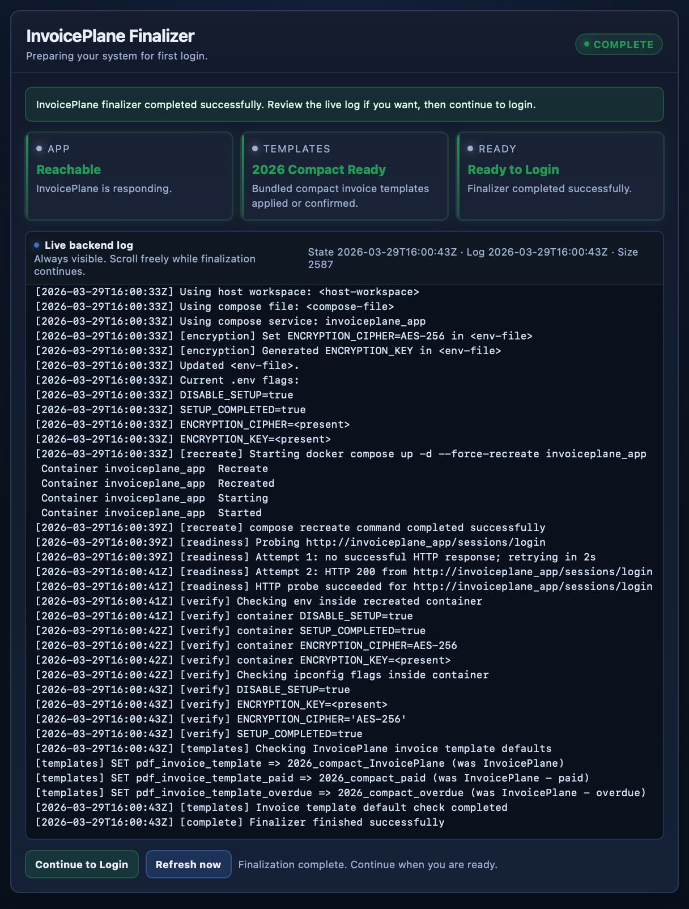

# 🚀 InvoicePlane-DockerX

<div align="center">


</div>

---

## 🧠 What This Project Is

**InvoicePlane-DockerX** is a **rebuild-safe, recovery-aware Docker setup for InvoicePlane**.

It is designed to behave predictably across:

- fresh installs  
- rebuilds  
- migrations  
- recovery scenarios  

This is not just a container that starts.

It is a system designed to **manage state correctly across installs, rebuilds, and recovery**.

---

## ⚡ Quick Start (Recommended Path)

### 1. Get the project

```bash
git clone https://github.com/MrCee/InvoicePlane-DockerX.git
cd InvoicePlane-DockerX
```

---

### 2. Prepare your environment

```bash
cp .env.example .env
```

Edit `.env` to suit your system.

---

### 3. Start the stack

```bash
./bin/up.sh
```

This is the **only supported startup method**.

It keeps preparation, validation, and startup behavior consistent across NAS, Linux, and macOS environments.

---

### 4. Complete setup

- open the installer in your browser  
- complete the InvoicePlane setup  
- wait for the finalizer to finish  
- click **Continue to Login**

---

### 5. Done

You should now have:

- a completed install  
- synchronized `.env` and runtime state  
- no setup or login loops  

---

## ✨ What This Setup Actually Does

### 🔁 Operator-first startup

Start the stack with:

```bash
./bin/up.sh
```

This ensures:

- bind mounts are prepared  
- environment is aligned  
- services start in the correct order  
- database readiness is handled  
- application startup is consistent  

---

### 🧭 Guided install + finalisation

The setup flow combines:

- the standard InvoicePlane installer  
- a backend-aware finalizer  



The finalizer:

- aligns `.env` with runtime state  
- ensures setup completion state is correct  
- generates and verifies encryption values  
- validates application reachability  
- exposes backend logs  
- provides a clear **Continue to Login** path  

As part of finalisation, sensible application defaults are applied.

This includes setting the bundled compact invoice templates as the default for new installs, so the system is ready to use without additional configuration.

Result:

- no setup loops  
- no login loops  
- no partial installs  
- a cleaner install-to-login experience  

---

### 💾 Persistent storage with bind mounts

Important state lives on the host:

- MariaDB data  
- uploads  
- logs  
- finalize state  
- helper overrides  
- views / CSS / language overrides  

This makes:

- rebuilds safer  
- debugging easier  
- customizations visible  
- recovery predictable  

---

### 📄 Document presentation and PDF customization

This project provides a **safe, non-destructive way to customize document output** in InvoicePlane.

It includes:

- custom invoice and quote templates (including the 2026 compact layouts)  
- improved PDF footer handling  

New installs default to the compact templates, providing a cleaner and more consistent document layout.  
Original InvoicePlane templates remain available at all times.

#### Behavior

- templates are added automatically on first run  
- existing files are never overwritten  
- user changes are preserved  
- deleted files are restored from the image  
- new templates can be introduced safely over time  

#### Custom templates

Custom templates are:

- baked into the image under `/opt/invoiceplane-seeds/views`  
- copied into the application only if missing  

Structure:

```text
docker/templates/views/
  invoice_templates/
    pdf/
    public/
  quote_templates/
    pdf/
    public/
```

Once seeded, templates appear inside InvoicePlane wherever invoice or quote PDF templates are selected.

#### PDF footer improvements

Includes a helper override for more consistent PDF output:

- split footer layout  
- page numbers on all pages  
- document reference on each page  
- stable multi-page rendering  

#### Result

- cleaner, more readable invoices and quotes  
- safe customization without losing defaults  
- no manual setup steps  
- upgrade-safe presentation changes  

More:

- [`docs/pdf-footer-override.md`](docs/pdf-footer-override.md)

---

### 🛡️ Recovery-first database tooling

Database imports are **reconcile-only**.

Instead of importing SQL dumps directly into the live database, data is:

- loaded into a temporary database  
- compared against a fresh installer-created schema  
- merged using controlled strategies  

This approach:

- works across InvoicePlane versions  
- tolerates schema differences  
- avoids fragile direct imports  
- produces safer recovery results  

Run:

```bash
./bin/invoiceplane-db-import.sh
```

More:

- [`docs/recovery.md`](docs/recovery.md)  
- [`docs/table-strategy-matrix.md`](docs/table-strategy-matrix.md)  

---

## 🧠 Design Principles

### 🔍 No hidden state

Everything important should be visible, inspectable, and traceable.

---

### 🔁 Host and container must agree

If `.env`, runtime, and application state differ, the system is broken.

The finalizer exists to keep them aligned.

---

### 🛠️ No blind operations

- no direct database imports  
- no silent overwrites  
- no unsafe assumptions  

---

### 🧬 Schema-aware recovery

Data should be adapted into the correct schema, not forced into it.

---

### 🔐 Explicit overrides

Overrides should be:

- tracked in Git  
- easy to audit  
- intentional  

---

### 🧭 Predictable operation

You should always know:

- what state the system is in  
- why it is in that state  
- what will happen next  

---

## 🕹️ Operator Interface

### `bin/` → control plane

- startup  
- recovery  
- reset  
- backup  

---

### `docs/` → knowledge base

- setup  
- operations  
- recovery  
- overrides  

---

### `docker/` → runtime internals

- entrypoints  
- finalizer  
- validation  

---

## 🧼 Clean Rebuild Philosophy

> Rebuild with intent. Never mutate containers casually.

Everything should be:

- explicit  
- reproducible  
- recoverable  

---

## ☠️ Destructive Developer Reset

```bash
./bin/dev-reset-install.sh
```

This resets:

- MariaDB  
- install state  
- encryption config  

⚠️ Read first:

- [`docs/dev-reset-install.md`](docs/dev-reset-install.md)

---

## 🎯 Who This Is For

- developers who want predictable Docker behavior  
- operators who care about recovery and data safety  
- people migrating older InvoicePlane installs  
- anyone tired of setup loops and broken imports  

---

## 🌏 Regional language overrides

Regional terminology can be customized through `invoiceplane_language/custom_lang.php`.

See [`docs/language-overrides.md`](docs/language-overrides.md) for an Australian example using `ABN` and `GST`.

---

## 🧩 Final Thought

This is not:

> “InvoicePlane in Docker”

This is:

> **A rebuild-safe, recovery-aware, state-consistent InvoicePlane operating model.**

---

## ⭐ If This Helped You

Star the repo — it saves real operator time.
